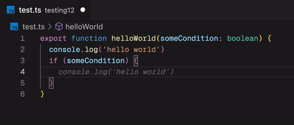
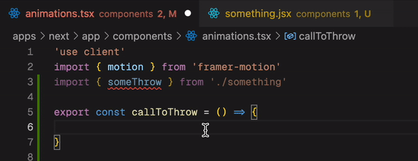

# Well, Does it Throw? 

TLDR; This is a *blazingly* fast **lsp server** to find *throw statements* in your javascript code. It's written in Rust and based on [SWC](https://swc.rs/) 🔥. It works for most ECMAScript files, such as `.ts`, `.js`, `.tsx` and `.jsx`. 

### Check it out in action:

Also supports **call expressions**:

## Why?

Maybe you're working on a large codebase riddled with throw statements everywhere, and you want a better control flow. Or perhaps you're just curious about how many throw statements you have in your codebase. This simple tool can help you with that.

Untyped `throw` statements can be a pain for those who come from languages like Go, where errors are typically values and first class citizens. Even Rust has the `Result` type. Knowing where throw statements are in your codebase might be helpful, even if their return types aren't [directly supported](https://github.com/microsoft/TypeScript/issues/13219).

> This extension may not be for everyone, but it's definitely for me. I hope you find it useful too.

## Installation

| Platform | Installation |
| -------- | ------------ |
| VsCode  | via [Marketplace](https://marketplace.visualstudio.com/items?itemName=michaelangeloio.does-it-throw) |
| NeoVim	| Coming soon... |

> This extension is built with security in mind. It doesn't send any data to any third party servers. All publishes are done via a signed immutable commit from the [CI pipeline](https://github.com/michaelangeloio/does-it-throw/blob/update-details/.github/workflows/release-please.yaml).

> The core of the code is written in Rust, and the LSP implementation for VsCode is written in Typescript. The Rust code is compiled to WASM and bundled with the VsCode extension. The extension is published to the VsCode marketplace, and the Rust code is published to [crates.io](https://crates.io/crates/does-it-throw). 

## Limitations

- This extension is still in its early stages. It's not perfect, but hope to gain sufficient ECMAScript coverage over time.
- Currently, it only supports ECMAScript files and the following file types: `.ts`, `.js`, `.tsx` and `.jsx`.
- Call expression tracing (Aka "Calls to Throws") is now set to one level deep. Hope to make this configurable in the future!

## Contributing
Contributions are certainly welcome! Please open an issue or submit a PR. If you find a use case that isn't supported yet, please search the open issues and open a new one if it doesn't exist.

## Feedback & Suggestions
Please use the GitHub discussions tab to provide feedback and suggestions. Thanks!

### Development & Technical Details
Everything can be found in the [CONTRIBUTING.md](./CONTRIBUTING.md) file!

## License
MIT
